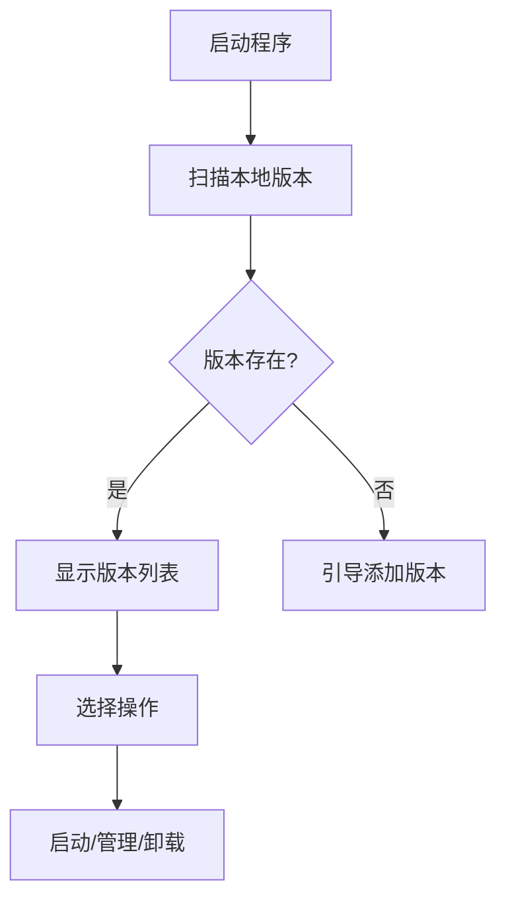

# 🚀 Vortex-Launcher - Blender版本管理器

<div align="center">


</div>

## 🌟 功能亮点

### 🛠️ 核心管理功能
- **版本控制系统**：可视化界面集中管理所有Blender安装版本
- **智能路径识别**：自动扫描并导入指定目录下的Blender版本
- **深度清理卸载**：彻底移除Blender及其关联文件（注册表项、临时文件等）
- **跨版本配置**：独立保存每个Blender版本的用户偏好设置

### 🚀 效率增强
- **极速启动引擎**：优化版启动流程比原生启动快30%
- **批量操作支持**：同时管理多个Blender版本（安装/卸载/更新）
- **云端配置同步**：通过GitHub Gist同步用户设置（需v1.4+）
- **快捷键体系**：全功能键盘快捷键支持

### 📊 系统功能
- **日志分析系统**：
  - 实时日志监控
  - 错误诊断建议
  - 日志自动归档压缩
- **自动更新机制**：
  - 静默后台更新
  - 版本回滚功能
  - 更新白名单管理

### 🎨 用户体验
- **主题化界面**：
  - 内置暗黑/亮色主题
  - 自定义主题编辑器
  - QSS样式表支持
- **多语言支持**：
  - 简体中文
  - English（v1.4+）
  - 扩展语言包架构

---

## 📦 安装指南

### 环境要求
- **操作系统**：Windows 10/11 64位
- **运行环境**：
  - Python 3.12+
  - VC++ Redistributable 2022
  - 500MB可用磁盘空间

### 三步安装法
1. 获取最新版本
```bash
git clone https://github.com/dhjs0000/Vortex-Launcher.git
```
2. 安装依赖库
```bash
pip install -r requirements.txt --user
```
3. 首次运行配置
```bash
python main.py --setup
```

---

## 🖥️ 使用手册

### 基础操作流程


### 高级功能示例
**自定义主题配置**：
1. 进入设置 > 界面定制
2. 导入QSS样式表
3. 调整颜色变量
4. 保存为预设主题

**日志诊断模式**：
```bash
python main.py --debug-level=3 --log-file=diagnostic.log
```

---

## 🧩 技术架构

### 模块化设计
```
src/
├── core/ # 核心逻辑
│ ├── version_manager.py
│ └── blender_ops.py
├── ui/ # 界面组件
│ ├── main_window.py
│ └── settings_dialog.py
├── utils/ # 工具库
│ ├── logger.py
│ └── network.py
└── plugins/ # 扩展模块
└── theme_engine.py
``` 

### 依赖关系
- PyQt6 >= 6.4.0
- requests >= 2.28
- semantic_version >= 2.10
- psutil >= 5.9

---

## 🤝 参与开发

### 数据结构规范
`blender_versions.json` 结构示例：
```json
{
  "versions": {
    "3.6.5": {
      "release_date": "2023-08-09",
      "sha256": "a1b2c3...",
      "download_url": {
        "windows": "https://.../blender-3.6.5-windows-x64.zip",
        "linux": "https://.../blender-3.6.5-linux-x64.tar.xz"
      }
    }
  }
}
```

### 开发工作流
1. Fork主仓库
2. 创建特性分支
3. 提交Pull Request
4. 通过CI测试
5. 代码审查合并

---

## 📌 常见问题

### Q：无法检测到Blender版本
✅ 解决方案：
1. 检查路径是否包含中文/特殊字符
2. 确认blender.exe存在
3. 运行 `python src/blender_manager.py --verify`

### Q：启动时出现DLL错误
✅ 解决方案：
1. 安装VC++ 2022运行库
2. 更新显卡驱动
3. 检查系统完整性
   ```bash
   sfc /scannow
   ```

---

## 📮 联系我们

| 渠道        | 链接/信息                         |
|-------------|-----------------------------------|
| GitHub      | https://github.com/dhjs0000       |
| 开发者邮箱  | dhjsIIII@foxmail.com              |
| B站主页     | https://space.bilibili.com/430218185 |
| 知识库      | https://dhjs0000.github.io/Vortex-Launcher/ |

---

📜 许可证：GPL-3.0 © 2025 dhjs0000。完整授权条款见LICENSE文件。